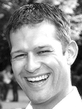
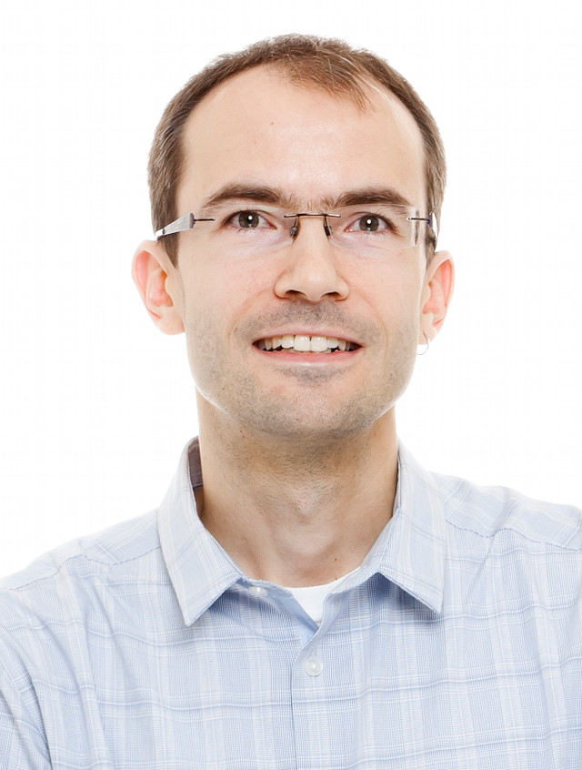

### Mitglieder des blockLAB Stuttgart-Netzwerkes

#### Jochen Kaßberger - GESCHÄFTSMODELLE, STRATEGIE, VENTURE, IOT

Jochen studierte Architektur an der Universität Stuttgart und beschäftigt sich seit Mitte der 90er Jahre mit dem Internet. Nach einem Aufenthalt in der US-amerikanischen Dot.Com Industrie um die Jahrtausendwende arbeitete er über zehn Jahre als Management- und Organisationsberater in der Automobil- und IT-Industrie. Im Frühjahr 2016 nahm er erfolgreich am MOOC DFIN 511 „Digital Currencies“ der University of Nicosia teil. Seine Begeisterung für die Internet- und Blockchaintechnologie führten dazu, blockLAB Stuttgart Anfang 2016 mit zu gründen.

Links: [transform management & beratung](http://www.transformmanagement.de/unternehmen/)

---

#### Axel Hodler

---

#### Robert Tuchel

---

#### Jan-Paul Buchwald - IT ARCHITECTURE, PROGRAMMIERUNG, FINTECH, IOT

Jan-Paul ist studierter Diplom-Informatiker und seit vielen Jahren im Bereich Java (EE) und Webanwendungen vornehmlich im Enterprise-Umfeld aktiv, seit 2014 als selbständiger IT-Berater und Software-Ingenieur. Als Mitgründer der Online-Plattform WunderNova hat er seit einiger Zeit auch Zugang zur Szene innovativer Startups, ist in diesem Zusammenhang auf das Potential des Themas Blockchain aufmerksam geworden und hat sich Mitte 2016 blockLAB Stuttgart angeschlossen.

Links: [YOPITER GmbH](http://www.yopiter.com), [WunderNova](http://www.wundernova.com), [Xing Profil](https://www.xing.com/profile/JanPaul_Buchwald), [LinkedIn Profil](https://www.linkedin.com/in/jan-paul-buchwald-23542423)

---

#### Dennis Schlegel

---

#### Dr. Arndt-Christian Kulow
